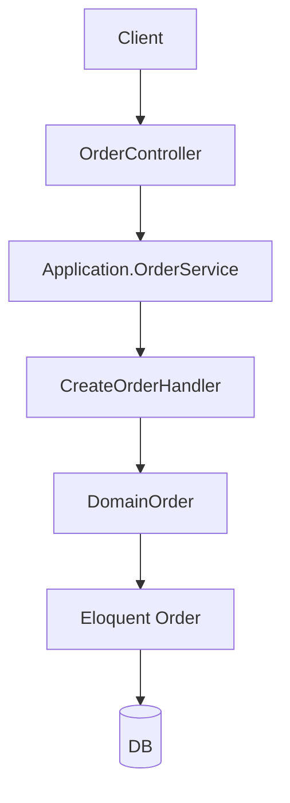
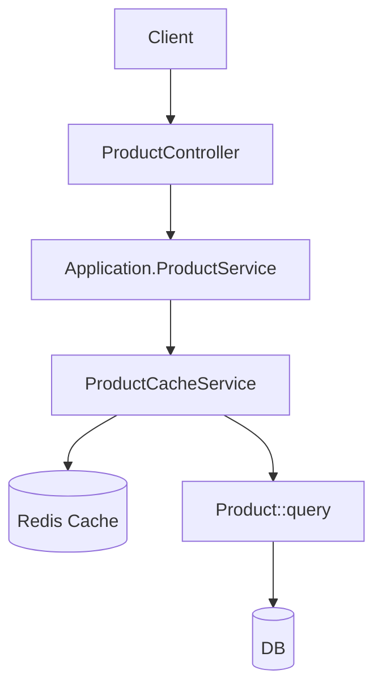

## Архитектура проекта

### Слои

- **Domain (`app/Domain`)**
  - Описывает бизнес-домен (заказы, товары).
  - Включает доменные сущности, контракты сервисов и мапперы.
- **Application (`app/Application`)**
  - Use-case слой: реализует прикладочные сценарии (создание заказа, смена статуса, список заказов/товаров).
  - Оркеструет доменные сервисы и инфраструктуру.
- **Infrastructure (`app/Infrastructure`)**
  - Интеграция с Laravel, события, джобы и адаптеры.
- **UserInterface (`app/UserInterface`)**
  - HTTP-контроллеры и API-ресурсы.
- **Legacy Services (`app/Services`)**
  - Технические/инфраструктурные сервисы (например, кеширование товаров). Постепенно вытесняются более явными доменными и application-сервисами.

### Поток данных: заказы

- **Создание заказа**
  - `OrderController@store` принимает `OrderStoreRequest`, преобразует вход в DTO.
  - `Application\Services\Order\Order\OrderService::create` делегирует в `CreateOrderHandler`.
  - `CreateOrderHandler`:
    - Создаёт `Order` и `OrderItem` в БД в транзакции.
    - Проверяет остатки товаров и уменьшает их.
    - Считает общую сумму заказа.
    - Возвращает доменную сущность `Domain\Order\Entities\Order` через `OrderMapper`.

- **Смена статуса**
  - `OrderController@updateStatus` упаковывает входные данные в DTO.
  - `OrderService::changeStatus` вызывает `ChangeOrderStatusHandler`.
  - `ChangeOrderStatusHandler` использует доменную сущность:
    - Проверяет допустимость перехода статуса.
    - Обновляет статус и служебные таймстемпы.
    - Генерирует событие `OrderStatusChanged`.

### Поток данных: товары

- **Список товаров**
  - `ProductController@index` использует `ProductIndexRequest` для валидации и сборки фильтров.
  - `Application\Services\Product\Product\ProductService::list` принимает готовые фильтры.
  - `ProductCacheService`:
    - Строит ключ кеша на основе фильтров.
    - Читает/записывает страницу результата в Redis.
    - При изменениях товаров инвалидирует только кеш с тегом `products`.

### Legacy и дальнейшее упрощение

- `App\Services\OrderService` заменён use-case обработчиками в `Application\Services\Order\Order\*Handler`.
- Кеш продуктов инкапсулирован в `ProductCacheService` с аккуратной инвалидизацией по тегу `products`, без глобального `Cache::flush()`.
- Новые точки расширения рекомендуется добавлять через:
  - доменные сущности и value-объекты,
  - отдельные use-case классы в `Application`,
  - тонкие контроллеры в `UserInterface`.

